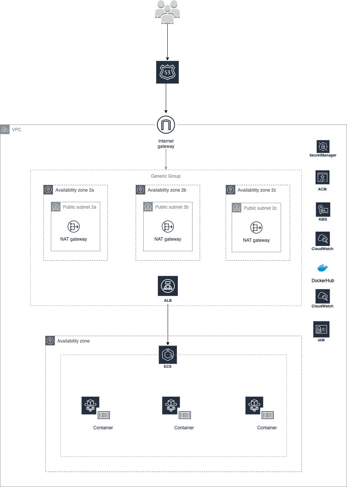

# Terraform

Hashicorp Terraform is utilised to provision the infra.

The setup here assumed to fetch few data from the already provisioned resources as part of separate infra project and reference it in the Terraform IaC in this project. For example VPC and it's associated resopurces, LoadBalancer access logs S3 buckets, ACM certificates, terraform artefacts like IAM role to assume, dynamodb table and s3 buckets etc.

## Architecture

### List of infrastructure provisioned
1. **ALB**: Internet Facing Load Balancer with Access logs set.
2. **TargetGroup**: To forward the traffic to the backend services running on windows container and to keep the target healthy on a specific port and healthcheck path.
3. **HTTP Listener**: To redirect all HTTP traffic to HTTPs.
4. **HTTPS Listener**: To terminate all SSL traffic in here with the defaut forward rule to the above target group.
5. **ECS Task Definition**: Container definition to run the FARGATE container (windows based: `WINDOWS_SERVER_2019_CORE`) within the ECS service.
6. **ECS Service**: A service to run the container in the private network and the traffic from load balancer will be forwarded to this ECS Service to access the application running within the container.
7. **CloudWatch Log Group**: To ship all the container logs to AWs CloudWatch LogGroup.
8. **SecurityGroups**: Security group for both ECS service and ALB to allow only the destined traffic. ECS Service allows traffic only from ALB.
9. **Secrets**: AWs secret manager to hold the credentials for the task definition to authenticate to the docker registry to successfully pull the docker image.
10. **KMS**: A AWS CMK Key to encrypt and decrypt the above secret.